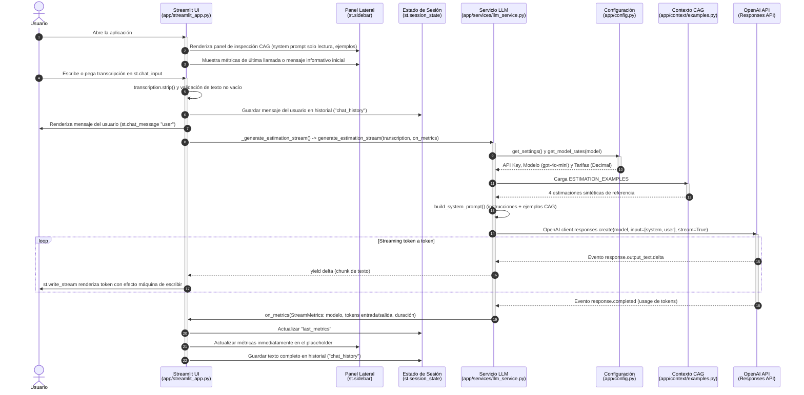

# estimador-cag

Estructura inicial del paquete `app`:

```text
app/
├── __init__.py
├── main.py
├── config.py
├── routers/
│   ├── __init__.py
│   └── estimations.py
├── services/
│   ├── __init__.py
│   └── llm_service.py
├── schemas/
│   ├── __init__.py
│   └── estimation.py
└── context/
    ├── __init__.py
    └── examples.py
```

`app/config.py` define `Settings` con Pydantic Settings y carga el archivo `.env` de la raíz. `.env.example` enumera las variables necesarias sin valores y `.env` está excluido de Git. Añade una clave API real para el proveedor que utilices antes de llamar al LLM.

`app/context/examples.py` contiene cuatro estimaciones sintéticas para usar como referencias en el prompt. Cada caso incluye un resumen de reunión, un desglose de horas y costes calculado con una tarifa ilustrativa de 60 €/hora, el equipo recomendado y una duración aproximada.

`app/services/llm_service.py` construye el prompt CAG con los cuatro ejemplos y llama a la API Responses de OpenAI con el modelo indicado por `LLM_MODEL` en `.env`. Envía las instrucciones y ejemplos como `system`, la transcripción como `user` y devuelve el texto generado por el asistente. `generate_estimation(transcription)` sigue devolviendo solo texto; `generate_estimation_details(transcription)` añade uso de tokens, coste estimado y metadatos; `generate_estimation_stream(transcription, on_metrics=...)` transmite la respuesta token a token y recopila métricas de ejecución (`StreamMetrics`: modelo, tokens de entrada, tokens de salida y tiempo de respuesta). Requiere `LLM_PROVIDER=openai` y `OPENAI_API_KEY` configurada.

`POST /api/v1/estimate` recibe `{"transcription": "..."}` y devuelve `estimation`, `model`, `provider`, `tokens_used`, `estimated_cost_usd`, `timestamp` y `response_id`. Los tokens proceden de la API Responses; las tarifas de texto de `gpt-4o-mini` están centralizadas en `app/config.py` y deben declararse con `Decimal("...")`, no con números `float`. Si cambias `LLM_MODEL`, registra también las tarifas de ese modelo en `MODEL_RATES`: el servicio rechazará la petición antes de llamar a OpenAI mientras falten. El coste es orientativo, no una factura, y será `null` si la API no devuelve datos de uso.

Los errores HTTP con cuerpo siguen RFC 9457 y usan
`application/problem+json`. El OpenAPI generado documenta los contratos `422`,
`500`, `502` y `503` de la estimación, incluidos sus tipos de problema estables.

`app/main.py` registra el router con el prefijo `/api/v1`, ofrece `GET /health` con `{"status": "ok"}` y configura el título y la descripción visibles en Swagger UI (`/docs`). El health check confirma que la API responde; no consulta al proveedor LLM.

## Flujo de ejecución (Diagrama de secuencia)

El siguiente diagrama muestra la secuencia completa de llamadas que se realizan desde que el usuario introduce una transcripción hasta que la estimación resultante y sus metadatos se renderizan en pantalla:



*(Nota: En la API HTTP FastAPI el flujo es análogo: el router `app/routers/estimations.py` valida la entrada mediante Pydantic `EstimationRequest`, delega en `generate_estimation_details()` y serializa la respuesta como `EstimationResponse` o `ProblemDetails` RFC 9457).*

## Cómo probar el proyecto (Guía rápida para el usuario)

Para probar el estimador de forma interactiva paso a paso:

### 1. Preparar el entorno y las dependencias

Asegúrate de tener instalado [uv](https://docs.astral.sh/uv/) y Python `>=3.13`. Luego sincroniza el proyecto:

```bash
uv sync
```

### 2. Configurar la clave de API

Copia el archivo de plantilla `.env.example` a `.env` y añade tu clave de OpenAI:

```bash
cp .env.example .env
```

Edita `.env` y define tu clave:
```env
OPENAI_API_KEY="sk-..."
LLM_PROVIDER=openai
LLM_MODEL=gpt-4o-mini
```

### 3. Lanzar la aplicación para probarla

Dispones de dos formas de probar el estimador:

#### Opción A: Interfaz interactiva de Chat (Recomendada)

Inicia la interfaz gráfica web en Streamlit:

```bash
uv run streamlit run app/streamlit_app.py
```

1. La aplicación se abrirá automáticamente en tu navegador en `http://localhost:8501`.
2. Explora el **panel lateral (sidebar)** de inspección CAG:
   - **Métricas de la última llamada:** muestra el modelo utilizado, el tiempo de respuesta y los tokens de entrada y salida (inicialmente con un aviso informativo antes de la primera estimación).
   - **System prompt activo:** visualización en solo lectura del prompt completo que instruye al modelo.
   - **Contexto CAG inyectado:** detalle de los ejemplos sintéticos de estimación que alimentan el contexto de referencia.
3. Pega una transcripción de reunión en el campo inferior. Por ejemplo:
   > *"El cliente necesita un portal web para clientes donde puedan consultar el estado de sus pedidos, descargar facturas en PDF y modificar sus datos de contacto. Requerirá autenticación segura y panel de administración."*
4. Pulsa Enter: la respuesta se generará en tiempo real vía streaming, tras lo cual las métricas de la llamada (tokens, modelo y duración) se actualizarán inmediatamente en la barra lateral.
5. El chat conserva el historial durante toda tu sesión de navegación.

#### Opción B: A través de la API REST y Swagger UI

Inicia el servidor FastAPI:

```bash
uv run uvicorn app.main:app --reload
```

1. Accede a la documentación interactiva en [http://127.0.0.1:8000/docs](http://127.0.0.1:8000/docs).
2. Despliega el endpoint `POST /api/v1/estimate`, pulsa en **Try it out**, introduce la transcripción y haz clic en **Execute**.
3. O bien desde tu terminal con `curl`:
   ```bash
   curl -X POST http://127.0.0.1:8000/api/v1/estimate \
     -H 'Content-Type: application/json' \
     -d '{"transcription": "Necesitamos crear un MVP de una app móvil para reservas de pistas de pádel."}'
   ```

---

## Guía de desarrollo (Development Guide)

Esta guía detalla cómo clonar y configurar el proyecto, recuperar un punto
de inicio etiquetado, arrancar los servicios y ejecutar las comprobaciones
automatizadas disponibles. Playwright está adoptado para las futuras pruebas
End-to-End (E2E), con soporte inicial limitado a Chromium.

### 1. Requisitos previos

- **Python** `>=3.13`
- [uv](https://docs.astral.sh/uv/) (gestor exclusivo de dependencias y entornos del proyecto)
- **Git**

### 2. Clonación y configuración del entorno

Clona el repositorio y sitúate en su raíz:

```bash
git clone https://github.com/ccacheroc/estimador-cag.git
cd estimador-cag
git fetch --tags --prune
```

El workflow `/cerrar-sesion` crea y publica un tag anotado con el formato
`inicio-sesion-<NN+1>`. Cada tag identifica el punto de partida validado para
la sesión siguiente. Para consultar los disponibles:

```bash
git tag --list 'inicio-sesion-*' --sort=-version:refname
```

Para continuar el trabajo desde uno de esos puntos, crea una rama a partir del
tag. No trabajes directamente sobre el tag, porque Git dejaría el repositorio
en estado `detached HEAD`:

```bash
git switch -c <nombre-rama> inicio-sesion-<NN>
```

Por ejemplo, para iniciar una rama de trabajo desde el comienzo validado de la
sesión 04:

```bash
git switch -c <usuario>/sesion04 inicio-sesion-04
```

El nombre y el mensaje de cada nuevo tag se confirman con el usuario durante
`/cerrar-sesion` antes de crearlo y subirlo a `origin`.

Copia la plantilla de configuración `.env.example` para generar tu archivo `.env`:

```bash
cp .env.example .env
```

Configura las variables necesarias en `.env`:
- `OPENAI_API_KEY`: Clave de API de OpenAI (necesaria para interactuar con el LLM en local).
- `LLM_PROVIDER`: Proveedor de LLM (por defecto `openai`).
- `LLM_MODEL`: Modelo a utilizar (por defecto `gpt-4o-mini`).
- `APP_ENV`: Entorno (`development`, `local`, etc.).
- `LOG_LEVEL`: Nivel de detalle del logging (`INFO`, `DEBUG`, etc.).

### 3. Instalación de dependencias

Sincroniza el entorno virtual y las dependencias (incluidas las de desarrollo):

```bash
uv sync
```

### 4. Instalación de navegadores para Playwright

El proyecto soporta actualmente solo Chromium para las futuras pruebas E2E.
Instala el binario gestionado por Playwright:

```bash
uv run playwright install chromium
```

*(Opcional)* Si estás en Linux y necesitas instalar dependencias del sistema operativo para los navegadores:

```bash
uv run playwright install --with-deps chromium
```

### 5. Arranque de los servicios en desarrollo

#### Backend (API FastAPI)
Inicia la API con recarga automática en caliente:

```bash
uv run uvicorn app.main:app --reload
```
- **Endpoint base:** `http://127.0.0.1:8000`
- **Health Check:** `http://127.0.0.1:8000/health`
- **Swagger UI:** [http://127.0.0.1:8000/docs](http://127.0.0.1:8000/docs)

#### Frontend (Chat Streamlit)
Inicia la interfaz web interactiva en una nueva terminal:

```bash
uv run streamlit run app/streamlit_app.py
```
- **Interfaz web:** `http://127.0.0.1:8501`

### 6. Suite de Pruebas (Testing)

#### Pruebas unitarias y de integración
Ejecuta todas las pruebas unitarias y de integración con `pytest`:

```bash
uv run pytest tests/test_*.py -v
```

#### Pruebas End-to-End (E2E) con Playwright

Playwright y Chromium están configurados, pero la suite E2E aún no contiene
pruebas ejecutables. Su implementación y conexión con CI están registradas en
[00-TRABAJO-PENDIENTE.md](00-TRABAJO-PENDIENTE.md). Cuando se implemente, estos
serán los comandos de ejecución:

- **Ejecución en modo headless (por defecto, para terminal y CI):**
  ```bash
  uv run pytest tests/e2e -v
  ```
- **Ejecución con navegador visible (modo headed / interactivo):**
  ```bash
  uv run pytest tests/e2e --headed
  ```
- **Ejecución con captura de trazas (Trace Viewer para depurar):**
  ```bash
  uv run pytest tests/e2e --tracing=on
  ```
- **Generador interactivo de código de Playwright:**
  ```bash
  uv run playwright codegen http://127.0.0.1:8501
  ```

#### Comprobación de tipos estáticos (Pyright)
Verifica el tipado estricto en `app/` y `tests/`:

```bash
uv run --no-sync pyright
```

## Documentación y decisiones de arquitectura

- Estado actual de la arquitectura: [docs/architecture-state.md](docs/architecture-state.md)
- Elección de framework HTTP: [docs/decisions/ADR-001-fastapi.md](docs/decisions/ADR-001-fastapi.md)
- Elección de framework E2E Playwright: [docs/decisions/ADR-002-playwright-e2e.md](docs/decisions/ADR-002-playwright-e2e.md)

La validación automática continua se define en
[.github/workflows/ci.yml](.github/workflows/ci.yml). En cada push a `main` y en
cada pull request, GitHub Actions instala las dependencias fijadas en `uv.lock`
y Chromium, comprueba `app/` y `tests/` con Pyright en modo estricto y ejecuta
las pruebas unitarias y de integración actuales con dobles para OpenAI. La
ejecución E2E en CI permanece pendiente hasta que exista al menos una prueba de
navegador.
