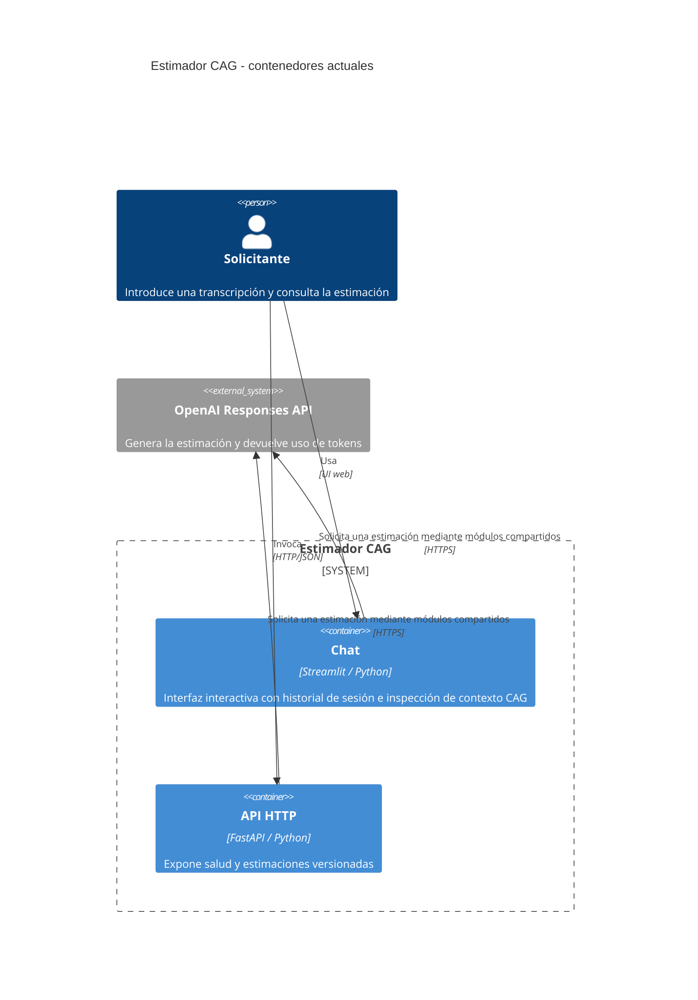
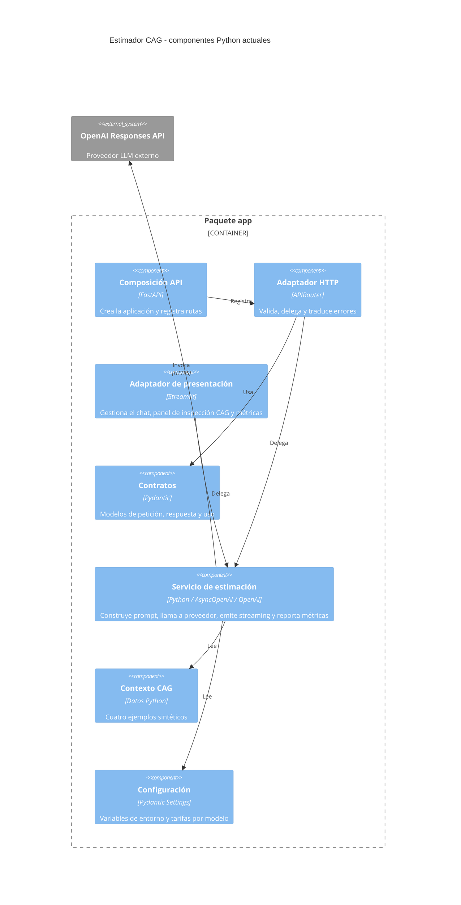

# Estado actual de la arquitectura

**Fecha de verificación:** 2026-09-20

**Alcance:** estructura y comportamiento observables en el repositorio. Este
documento describe el estado implementado; las convenciones que guían su
evolución viven en
[`backend-standards.md`](../.harness/rules/backend-standards.md) y
[`frontend-standards.md`](../.harness/rules/frontend-standards.md).

La decisión de usar FastAPI y sus consecuencias está documentada en
[ADR-001](decisions/ADR-001-fastapi.md). La adopción de Playwright para pruebas
End-to-End de navegador se documenta en
[ADR-002](decisions/ADR-002-playwright-e2e.md).

## Resumen

El sistema ofrece dos entradas ejecutables para el mismo caso de uso:

- una API HTTP FastAPI con `GET /health` y `POST /api/v1/estimate`;
- una interfaz de chat Streamlit con historial durante la sesión y panel lateral de inspección CAG (system prompt en solo lectura, contexto de ejemplos inyectados y métricas de la última llamada).

Ambas entradas reutilizan el servicio de estimación. Este construye un prompt
con cuatro ejemplos CAG estáticos, consulta la API Responses
de OpenAI y devuelve la estimación con metadatos de modelo, uso y coste (o en tiempo real vía streaming con captura de métricas). No hay
persistencia, autenticación, autorización, RAG ni orquestación de agentes.

## C4: diagrama de contenedores

Los dos contenedores importan los mismos módulos Python de servicio,
configuración y contexto. Esos módulos no son un despliegue independiente: se
ejecutan dentro del proceso FastAPI o Streamlit que atiende cada interacción.

## C4: componentes internos

## Componentes implementados

| Responsabilidad | Ubicación actual | Estado observable |
| --- | --- | --- |
| Composición FastAPI | [`app/main.py`](../app/main.py) | Crea la aplicación, registra rutas, manejadores de error y expone `/health` |
| Transporte HTTP | [`app/routers/estimations.py`](../app/routers/estimations.py) | Expone `/estimate`, delega en el servicio y traduce errores a `502` o `503` |
| Contratos | [`app/schemas/`](../app/schemas/) | Valida la transcripción y serializa respuestas satisfactorias y Problem Details |
| Errores HTTP | [`app/http_errors.py`](../app/http_errors.py) | Convierte validación y excepciones HTTP a RFC 9457 y normaliza su OpenAPI |
| Presentación web | [`app/streamlit_app.py`](../app/streamlit_app.py) | Chat, historial de sesión, panel lateral con inspección CAG (system prompt, ejemplos) y métricas de la última llamada (modelo, tokens, tiempo) |
| Caso de uso e integración LLM | [`app/services/llm_service.py`](../app/services/llm_service.py) | Construye el prompt, usa `AsyncOpenAI`/`OpenAI`, emite streaming con callback de métricas (`StreamMetrics`) y calcula coste y uso |
| Contexto CAG | [`app/context/examples.py`](../app/context/examples.py) | Contiene cuatro estimaciones sintéticas incorporadas al prompt |
| Configuración | [`app/config.py`](../app/config.py) | Lee entorno y `.env`, y registra tarifas de `gpt-4o-mini` |

## Flujos actuales

### API HTTP

1. El cliente envía `POST /api/v1/estimate` con `transcription`.
2. Pydantic elimina espacios exteriores y rechaza texto vacío.
3. El router delega en `generate_estimation_details`.
4. El servicio valida proveedor, credenciales, modelo y tarifas; compone el
   prompt con los ejemplos CAG y llama a OpenAI.
5. El router devuelve la estimación y sus metadatos o traduce el fallo al
   estado HTTP correspondiente.
6. Los errores con cuerpo se serializan como RFC 9457 con
   `application/problem+json`; OpenAPI declara los contratos `422`, `500`,
   `502` y `503` del endpoint de estimación.

`GET /health` solo confirma que el proceso HTTP responde; no consulta OpenAI.

### Chat Streamlit

1. La interfaz renderiza el panel lateral (`st.sidebar`) con las métricas de la última estimación (o mensaje informativo inicial), el system prompt activo en solo lectura y los ejemplos CAG inyectados.
2. La interfaz recupera el historial desde `st.session_state`.
3. El usuario introduce una transcripción mediante `st.chat_input`.
4. La interfaz consume la estimación en tiempo real token a token
   mediante `generate_estimation_stream` y `st.write_stream`.
5. Al completarse la respuesta del stream, el callback `on_metrics` actualiza `StreamMetrics` en `st.session_state` y refresca inmediatamente el contenedor de métricas en el panel lateral.
6. La estimación o el error se muestran como respuesta del asistente y se
   incorporan al historial de la sesión.

La interfaz no llama al endpoint FastAPI: ambos adaptadores importan el mismo
servicio Python y pueden ejecutarse como procesos independientes.

## Configuración y ejecución

- `pyproject.toml` declara Python 3.13 o posterior, FastAPI, OpenAI, Pydantic
  Settings y Streamlit; `uv.lock` fija la resolución.
- `.env.example` enumera las variables esperadas y `.env` queda fuera del
  control de versiones.
- La API arranca con `uv run uvicorn app.main:app --reload`.
- La UI arranca con `uv run streamlit run app/streamlit_app.py`.
- Solo se admite actualmente `LLM_PROVIDER=openai`. El modelo debe tener
  tarifas registradas antes de realizar la llamada externa.

## Verificación automatizada

Las pruebas unitarias y de integración (`tests/`) comprueban la estructura mínima,
el contrato HTTP, los Problem Details y su declaración OpenAPI, la composición del prompt,
los metadatos y la integración de Streamlit con el servicio. Las pruebas End-to-End
de navegador sobre la interfaz web Streamlit se implementan con Playwright
(`pytest-playwright` en `tests/e2e/`). Las llamadas externas se sustituyen por dobles de
prueba en todas las suites para garantizar aislamiento y no incurrir en costes externos.
GitHub Actions ejecuta la suite en pushes a `main` y pull requests.

## Límites conocidos

- No existen persistencia, usuarios, autenticación ni autorización.
- El historial del chat solo vive durante la sesión Streamlit.
- Solo está implementado OpenAI como proveedor.
- No hay una política propia de timeout, reintentos o límites de concurrencia.
- El health check no verifica la disponibilidad del proveedor externo.
- El coste calculado es orientativo y depende de las tarifas configuradas.
- RAG, recuperación semántica y agentes pertenecen a evoluciones futuras, no
  al estado implementado.
