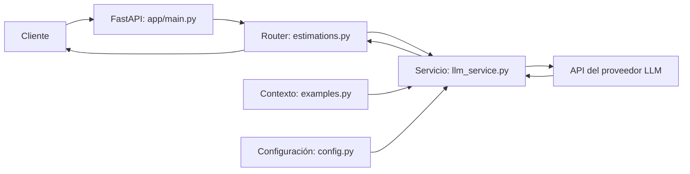

# Arquitectura del estimador CAG

Este documento describe la arquitectura prevista para la primera fase CAG del proyecto y distingue esa intención del código ya implementado. La referencia funcional es el texto facilitado para esta tarea; el estado actual se comprobó en el repositorio.

La elección del framework HTTP y sus consecuencias constan en [ADR-001: FastAPI](decisions/ADR-001-fastapi.md).

## Objetivo

El servicio recibirá la transcripción de una reunión con un cliente y devolverá una estimación de software generada por un LLM. En la fase CAG, el prompt incluirá ejemplos de estimaciones definidos en código. La recuperación semántica de ejemplos pertenece a una fase RAG posterior.

La organización por capas permite cambiar la construcción del prompt, el proveedor LLM o el contrato HTTP en su componente correspondiente. La frontera de cada capa es:

| Capa | Ubicación | Responsabilidad | Estado actual |
| --- | --- | --- | --- |
| Composición | [`app/main.py`](../app/main.py) | Crear FastAPI, registrar routers y ofrecer health check | Implementada |
| Transporte | [`app/routers/estimations.py`](../app/routers/estimations.py) | Recibir la petición, validarla, delegar y devolver la respuesta | `POST /api/v1/estimate` implementado |
| Servicio | [`app/services/llm_service.py`](../app/services/llm_service.py) | Formar el prompt, llamar a OpenAI y procesar la salida | API Responses, tokens y coste estimado implementados |
| Contratos | [`app/schemas/estimation.py`](../app/schemas/estimation.py) | Definir modelos Pydantic de petición y respuesta | Implementados |
| Contexto CAG | [`app/context/examples.py`](../app/context/examples.py) | Proporcionar ejemplos para inyectar en el prompt | Cuatro casos sintéticos implementados |
| Configuración | [`app/config.py`](../app/config.py) | Cargar variables del entorno y tarifas por modelo | `Settings` y tarifas de `gpt-4o-mini` implementadas |

El código de `app/main.py` debe permanecer breve: composición de la aplicación, registro de routers y configuración transversal. La lógica de estimación reside en el servicio. El router gestiona HTTP y depende del contrato de entrada y salida; no construye prompts ni llama al LLM directamente.

## Flujo previsto de una estimación

El contrato de la primera versión es `POST /api/v1/estimate`: recibe una transcripción y devuelve la estimación, el modelo, el proveedor, el uso de tokens, el coste estimado en USD, un timestamp UTC y el identificador de la respuesta de OpenAI. `GET /health` devuelve `{"status": "ok"}` como comprobación de que el proceso responde. `app/main.py` aplica el prefijo `/api/v1` al registrar el router para reservar espacio para evolucionar el contrato sin cambiar la versión vigente.

Los schemas validan la transcripción en la frontera HTTP y serializan la respuesta. Una transcripción ausente o vacía se rechaza; el texto de referencia propone una longitud mínima de 50 caracteres, pero esa restricción no está aplicada.

## Concurrencia y límites entre capas

La llamada a una API LLM es una operación de espera de red. Para que una ruta `async` libere el event loop durante esa espera, el servicio debe usar operaciones que admitan `await`. Una llamada síncrona hecha directamente dentro de una función `async` bloquearía ese event loop. El servicio usa `AsyncOpenAI`; la política de timeouts, reintentos y errores HTTP queda pendiente de definir. La [guía de concurrencia de FastAPI](https://fastapi.tiangolo.com/async/) explica esta distinción.

La capa de servicio debe permitir probar el formato del prompt sin llamadas HTTP ni peticiones reales al LLM. El router debe poder probarse con un servicio sustituido o simulado. No hay aún una carpeta `tests/`.

El servicio envía dos elementos en `input` de la API Responses: `system` contiene las instrucciones y los ejemplos CAG; `user` contiene la nueva transcripción. La respuesta del asistente se lee mediante `response.output_text`.

`LLM_MODEL` determina el modelo de la llamada. Antes de consultar OpenAI, el servicio exige que `app/config.py` tenga tarifas registradas para ese modelo; un cambio de modelo debe acompañarse de sus tarifas para mantener coherente el coste estimado.

## Evolución prevista

1. **CAG actual:** ejemplos estáticos en `context/examples.py`; el servicio los formatea e inyecta en el prompt.
2. **RAG posterior:** incorporación de ingesta, embeddings y recuperación de ejemplos relevantes. La fuente de contexto pasaría a ser un componente de búsqueda; la elección de base de datos vectorial no está tomada en este repositorio.
3. **Agentes posteriores:** orquestación y herramientas especializadas sin trasladar la lógica de negocio a los routers.

Estas fases son una dirección de diseño, no funcionalidades existentes. Al introducir nuevos servicios o contratos, se mantendrán las responsabilidades de composición, transporte, servicio, contrato y contexto.
